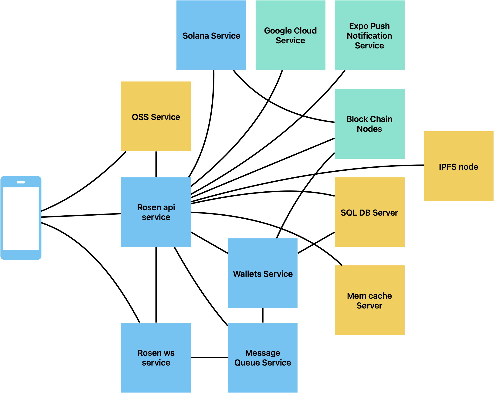

# Rosen Open Source

## 🌹 ROSEN APP

The Revolutionary Social Trading App - 
Seamless cross-border connections, powered by PYUSD & Google Cloud’s Blockchain RPC

- MIT License

- GCP Blockchain RPC

- PYUSD

- Gasless Seamless Borderless

## 🏆 Why ROSEN?

ROSEN is the first social trading platform powered by Google Cloud and PayPal PYUSD, designed to solve real-world problems:

### 🔥The Problem We Solve
Today, 95% of people globally face three brutal barriers when working across borders:

- Language Walls:
  - A Brazilian marketing manager lost business opportunities due to misunderstandings with Japanese clients, despite having valuable skills.
- Payment Friction:
  - A Nigerian designer paid $25 in fees to receive a $50 cross-border payment – 50% of the transaction value.
- Opportunity Exclusion:
  - A Venezuelan influencer could not receive international micropayments of less than $10 as a tip

### ROSEN changes this with:

✅ AI-powered real-time translation

✅ PYUSD stablecoin for zero-fee microtransactions

✅ GCP Blockchain RPC ensuring 20-second settlements

[Home Page](https://www-stag.gorosen.xyz)

## For Users

✨ Polished Frontend: A user-friendly UX designed for non-crypto natives – no seed phrases, no gas fees, just Gmail login and go!

🌐 Cross-border focus,solve a real-world problem: Break down language barriers, unlock potential and opportunities for global social economy.

🔥 Gasless, seamless & instant transfers: Send PYUSD without paying gas (ROSEN covers fees!) to anyone in chat, just like sending a message! "Imagine tipping $10 as easily as sending a text"

🔒 Accessible & compliant: Live on the App Store and Google Play Store with a focus on compliant stablecoins

## For Hackathon Judges
✅ PYUSD + GCP RPC: 

Leverages Google Cloud’s Ethereum mainnet RPC for reliable, scalable and gasless transactions on app-native PYUSD with wallet abstract, which bring the real-world impact to ordinary people.

## 🎮 Key Features

Feature | Tech Stack | Competitive Edge
------- | ---------- | -------------------
1-Click PYUSD Onboarding | WalletConnect + wallet abstract + GCP RPC | No crypto jargon – just Gmail + PayPal!
| Gasless Social Trading | GCP Batch Transactions | Users pay zero gas for in-app transfers,solves microtransaction cost barrier
Cross-border seamless social trading |  AI Translation + In-Chat PYUSD | Transfer stablecoins to anyone in chat - just like sending a message! Showcases real-world PYUSD utility
Multi-Chain Dashboard |  React + Ethers.js | Prepares for future GCP analytics integration

## ⚙️ PYUSD & GCP Blockchain RPC Integration

### How We Use Google Cloud:

- Ethereum Mainnet RPC:
  - Endpoint: https://blockchain.googleapis.com/v1/projects/YOUR_PROJECT_AND_KEY_HERE
  - Used for: PYUSD deposit/withdrawal transactions (low-latency confirmations).

### How We Integrate PYUSD:

- Deposit, withdraw, tranfer PYUSD with 0 gas token
  - Uses GCP’s trace_block to verify PYUSD mint/burn events
  - Wallet abstraction hides contract calls from end-users

- Business Impact

Metric | Traditional Apps | ROSEN + PYUSD
------- | ---------- | -------------------
Min. Transfer | $50+ | $10
| Fee per tx | $20+ | $0
Settlement | 1-5 days | 20 sec
Compliance | ❌ Unverified | ✅ PayPal-backed


## 🛠️ Setup & Run

### Architecture



### Quick Start

You can download our App from [App Store](https://apps.apple.com/us/app/rosen/id6444627514) / [Google Play](https://play.google.com/store/apps/details?id=com.rosenbridge.rosen&pli=1) for a quick experience.

And you can also download the [Beta Version](https://expo.dev/accounts/rosen-bridge/projects/rosen/builds/4efa0f19-da05-450a-a2c6-3a562d60ebbc) for new features such as PYUSD supports.

### Build & Run Client

```
cd client
npm i
npm run dev
```

### Build & Run Server

1. requirements: 

  - golang >= 1.23.4
  - mysql >= 8.0
  - redis

2. build

```
cd server-contract
go mod download
go build
```

2. Edit ```config.yaml``` with your favorate editor. e.g. ```vim```

```
vim config.yaml
```

3. Launch for first time.

```
./rosen-apiserver server --config config.yaml --migratedb yes
```

## 📈 Future Roadmap

- GCP-Powered Analytics:
  - Real-time PYUSD dashboards (BigQuery + Colab).
  - MEV monitoring via trace_transaction.

- PayPal On/Off-Ramps
  - Direct PYUSD purchase/withdraw when APIs launch


## 📜 License

MIT © ROSEN Team.

**Judges, see our submission [video] (https://youtu.be/DrGheKvdocc) here for a gasless seamless PYUSD social trade demo!**
